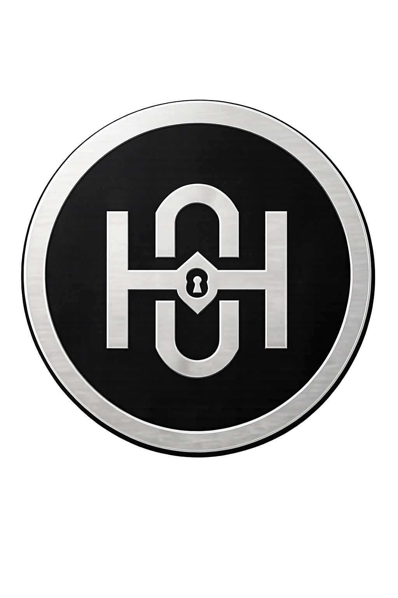

<div align="center">
  
</div>

<h1 align="center">Harlen Galdino</h1>

<p align="center">
  <strong>Full-stack Developer</strong> • Interfaces modernas • APIs robustas • Observabilidade
</p>

<p align="center">
  
</p>

<div align="center">
  <a href="https://harlengaldino.vercel.app/" target="_blank">
    
  </a>
  <a href="https://br.linkedin.com/in/harlen-galdino-527ba9349" target="_blank">
    
  </a>
  <a href="mailto:harlengaldino3@gmail.com" target="_blank">
    
  </a>
  <a href="https://github.com/Harlen539" target="_blank">
    
  </a>
</div>

---

## Sobre mim

Sou Harlen Galdino, desenvolvedor web e analista de monitoramento NOC. Gosto de transformar ideias em produtos digitais bem estruturados, com atenção a interface, performance, estabilidade e clareza na experiência do usuário.

Atualmente estudo **Sistemas para Internet** e aprofundo minha base em desenvolvimento full-stack, APIs, bancos de dados, monitoramento e boas práticas para aplicações confiáveis.

```txt
Localizacao: Joao Pessoa, Paraiba - Brasil
Foco atual: React, Node.js, TypeScript, Java, Spring Boot, Python e Observabilidade
Interesses: Front-end, Back-end, APIs, Performance, NOC, Zabbix e Grafana
```

---

## Stack principal

<div align="center">
  
</div>

<br>

<div align="center">
  
  
  
  
</div>

---

## Projeto em destaque

<table>
  <tr>
    <td width="60%">
      <h3>Portfolio pessoal</h3>
      <p>
        Interface responsiva construída para apresentar minha trajetória, tecnologias, projeto em destaque e canais de contato.
        O projeto conta com tema claro/escuro, suporte a idiomas, animações suaves e links diretos para documentações oficiais das tecnologias.
      </p>
      <p>
        <strong>Stack:</strong> React, Vite, CSS, JavaScript e Vercel.
      </p>
      <a href="https://harlengaldino.vercel.app/" target="_blank">
        
      </a>
      <a href="https://github.com/Harlen539/Portifolio" target="_blank">
        
      </a>
    </td>
    <td width="40%" align="center">
      <a href="https://harlengaldino.vercel.app/" target="_blank">
        
      </a>
    </td>
  </tr>
</table>

---

## GitHub em números

<div align="center">
  
  
</div>

<div align="center">
  
</div>

---

## Contato

<div align="center">
  <a href="mailto:harlengaldino3@gmail.com">
    
  </a>
  <a href="https://wa.me/5583996253060" target="_blank">
    
  </a>
  <a href="https://br.linkedin.com/in/harlen-galdino-527ba9349" target="_blank">
    
  </a>
</div>

---

<div align="center">
  <sub>Construindo, aprendendo e refinando um commit de cada vez.</sub>
</div>
